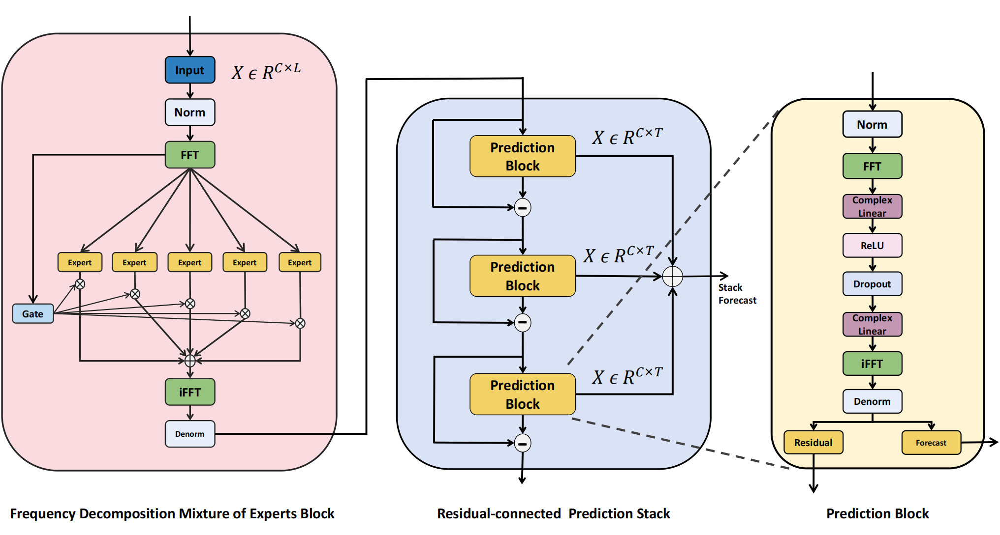

# FreqMoE: Enhancing Time Series Forecasting through Frequency Decomposition Mixture of Experts (AISTATS 2025 poster)
The official implementation of "FreqMoE: Enhancing Time Series Forecasting through Frequency Decomposition Mixture of Experts".

[[Arxiv]](https://arxiv.org/abs/2501.15125)

## TLDR
In this project we propose **FreqMoE**, a frequency-based Mixture of Experts model for long-term time series forecasting. Unlike existing methods, FreqMoE dynamically decomposes time series into frequency bands, with specialized experts processing each band. A gating mechanism adjusts expert contributions, and a prediction module refines forecasts via residual connections. Experiments show FreqMoE achieves SOTA performance across eight datasets while keeping parameters under **50k**, ensuring high efficiency.

## Overall Architecture


## Datasets Preparation
You can access all nine benchmark datasets from the [Google Drive](https://drive.google.com/drive/folders/1ZOYpTUa82_jCcxIdTmyr0LXQfvaM9vIy) link provided in Autoformer. These datasets are well pre-processed and readily usable. Please download the datasets and put them in the ```./dataset``` folder. Each dataset is an ```.csv``` file.

## Environment requirements
```python
pip install -r requirements.txt
```
Please refer to the ```requirements.txt``` file for the required packages.

## Acknowledgement
We thank the authors of the following repositories for their open-source code or dataset, which we used in our experiments:

- **MoLE:** ([https://github.com/RogerNi/MoLE](https://github.com/RogerNi/MoLE))

- **TimeMixer:** ([https://github.com/kwuking/TimeMixer?tab=readme-ov-file](https://github.com/kwuking/TimeMixer?tab=readme-ov-file))

- **iTransformer:** ([https://github.com/thuml/iTransformer](https://github.com/thuml/iTransformer))

- **Informer:** ([https://github.com/zhouhaoyi/Informer2020](https://github.com/zhouhaoyi/Informer2020))

- **Time-Series-Library:** ([https://github.com/thuml/Time-Series-Library](https://github.com/thuml/Time-Series-Library))

## Citation
If you find our work useful, please consider citing our paper using the following BibTeX:

```python
@inproceedings{
liu2025freqmoe,
title={FreqMoE: Enhancing Time Series Forecasting through Frequency Decomposition Mixture of Experts},
author={Ziqi Liu},
booktitle={The 28th International Conference on Artificial Intelligence and Statistics},
year={2025},
url={https://openreview.net/forum?id=LGkLTYLIBq}
}
```
